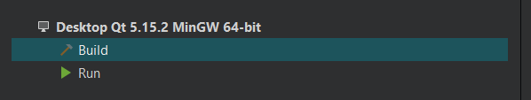

## Getting Started <a name =" get-stared"></a>
> This is an list of needed instructions to set up your project locally, to get a local copy up and running follow these
> instructions.
## Prerequisite
   - Qt Framework
   - Mingw compiler
  
## Installing
 1. ***Clone  the repositery***
```
https://github.com/ZiadSheriif/Qt-Learning.git
```
 2. ***Open folder project (CMakeLists.txt)***


## Running Program
 1. ***Choose the kit with 64-bit***
   


 2. ***Delete all other kits***
 3. ***Run App***


---
#### QT Installation

We need Qt5, use [this link](https://www.qt.io/download) to download it.  
- Choose `Custom installation` 

Proceed  to choose the following packages


- Under `Additional libraries>Qt`
  - Qt charts
- Under `Qt>qt 5.15.2`
  - Qt charts
  - MinGW 8.1.0 64 bits (Windows only)
  - Qt Data Visualization
- Developer and Designer Tools
  - Qt Data Visualization (Note that this one seems to have been moved under `Additional libraries>Qt` for Linux)
  - Qt Creator
  - Debugging Tools
  - MinGW 8.1.0 64 bits
  - Cmake
  - Ninja